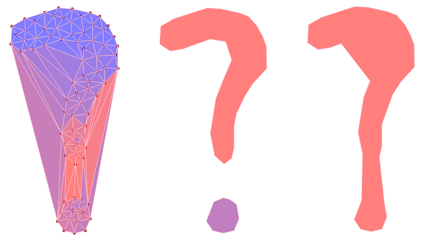

# d3.geom.concaveHull

D3 already includes convex hulls with `d3.geom.hull`. This brings together several methods developed by Jason Davies, Gregor Aisch and Ian Johnson to expose a simple way to generate concave hulls from an array of data.

[Simple Example](http://bl.ocks.org/emeeks/436c12e5bea2bdb9de57)

[Complex Example with Geodata](http://bl.ocks.org/emeeks/bcc67e2977a96d547a06)

`npm install d3-geom-concavehull`

**#concaveHull(data)** Returns an array of arrays, each of which contains an array of points for the shape bounding the points in `data` according to the set distance.

**#concaveHull.distance** Sets or gets a function calculating the maximum distance of a point can be from another point before they're treated as being separated. The default is to calculate the length of the edges of all triangles and set the cutoff at mean + standard deviation. You could also set it to a number if you know the distance you want.

**#concaveHull.padding** (Broken) Sets or gets a number (positive or negative) to grow or shrink the created hulls in pixels. Negative numbers will shrink the hulls, positive numbers will grow them.
